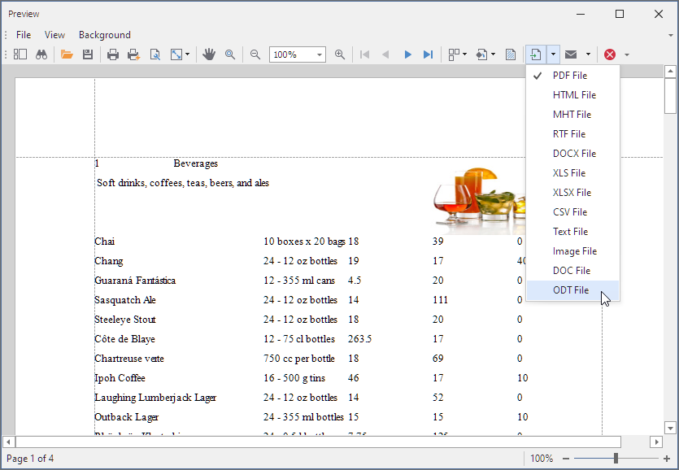

<!-- default badges list -->

<!-- default badges end -->
# Reporting for WinForms - Export to DOC and ODT Formats

This example shows how to add custom bar items to the **File Export** drop down menu and export a report to DOC and ODT file formats using the [RichEditDocumentServer](https://docs.devexpress.com/OfficeFileAPI/DevExpress.XtraRichEdit.RichEditDocumentServer).

## Files to Review

* [Form1.cs](./CS/WindowsFormsApplication1/Form1.cs) (VB: [Form1.vb](./VB/WindowsFormsApplication1/Form1.vb))
* [XtraReport1.cs](./CS/WindowsFormsApplication1/XtraReport1.cs) (VB: [XtraReport1.vb](./VB/WindowsFormsApplication1/XtraReport1.vb))

## Documentation

- [Export Reports](https://docs.devexpress.com/XtraReports/1302/detailed-guide-to-devexpress-reporting/store-and-distribute-reports/export-reports)

## More Examples

- [Reporting - Web Document Viewer - Add PowerPoint Export Format](https://github.com/DevExpress-Examples/reporting-web-viewer-powerpoint-export)
- [Reporting for WinForms - How to Use MailKit to Send a Report as a Document in PDF](https://github.com/DevExpress-Examples/reporting-winforms-mailkit-email-report-pdf)
- [Reporting for WinForms - Export a Report to ZUGFeRD](https://github.com/DevExpress-Examples/reporting-winforms-export-pdf-zugferd)
<!-- feedback -->
## Does this example address your development requirements/objectives?

 

(you will be redirected to DevExpress.com to submit your response)
<!-- feedback end -->
